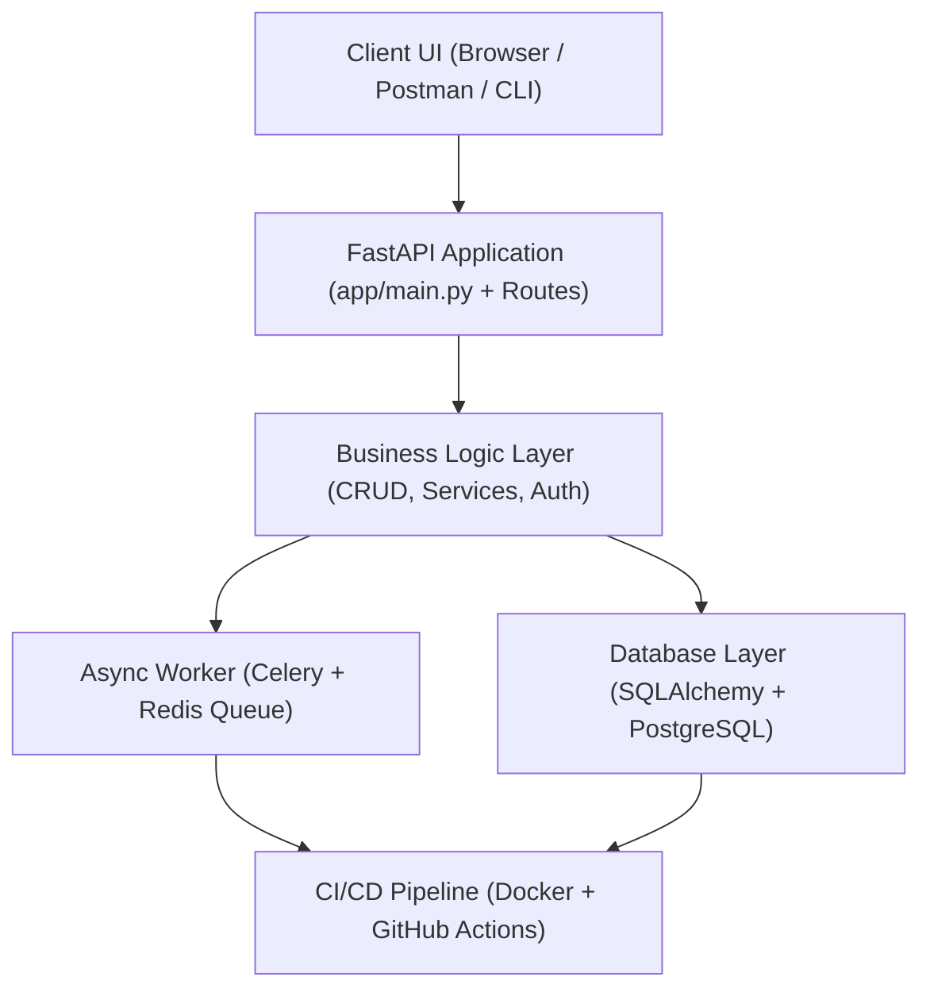
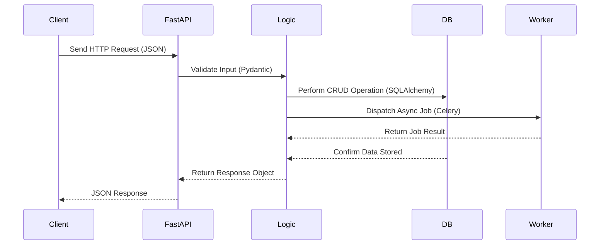
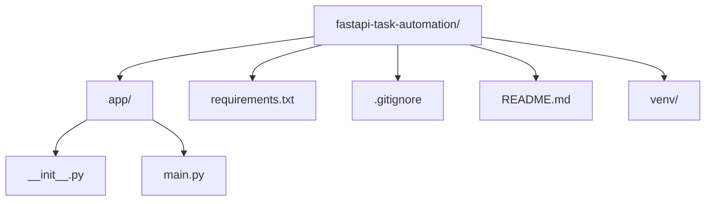

# FastAPI Task Automation
A production-grade FastAPI microservice designed for backend task automation with JWT authentication, PostgreSQL database, Celery + Redis background jobs, Docker and CI/CD integration, and automated testing.

---

## Day 1 — Project Initialization
Goal: create the base FastAPI project structure, set up a virtual environment, install dependencies, and verify that the API runs locally.

### Achievements
- Initialized Git repository and Python virtual environment  
- Installed FastAPI, Uvicorn, SQLAlchemy, Pydantic, Psycopg2-Binary, and Python-Dotenv  
- Added base route (`GET /`) returning a startup message  
- Verified server runs on http://127.0.0.1:8000  

---

## Quick Start

```bash
# 1. Clone repository
git clone git@github.com:SulimanKh87/fastapi-task-automation.git
cd fastapi-task-automation

# 2. Create and activate virtual environment
python -m venv venv
source venv/Scripts/activate      # or venv\Scripts\activate on Windows

# 3. Install dependencies
pip install -r requirements.txt

# 4. Run FastAPI server
uvicorn app.main:app --reload

Then open http://127.0.0.1:8000
```
Visit:
http://127.0.0.1:8000
 → root message
http://127.0.0.1:8000/docs
 → Swagger UI (auto docs)

## System Architecture



**Key Components**
- **FastAPI** — REST API framework (main entry point)
- **SQLAlchemy / PostgreSQL** — relational data storage
- **Celery + Redis** — asynchronous background task queue
- **Docker + GitHub Actions** — containerization & CI/CD automation
- **Pytest** — testing & coverage for backend logic

```markdown
## API Workflow Overview

🧠 Workflow Summary
Client sends an HTTP request (e.g., POST /tasks)
FastAPI receives → validates via Pydantic Schemas
Business Logic executes CRUD via SQLAlchemy models
Celery Worker performs async jobs if needed
Database stores data (PostgreSQL engine)
FastAPI returns a JSON response to the client

```markdown
## Project Structure
```

## Dependencies
fastapi
uvicorn
sqlalchemy
psycopg2-binary
python-dotenv
pydantic

## License
MIT License
## Author
Suleiman Khasheboun
Email: suli.tempmail2022@gmail.com
GitHub: https://github.com/SulimanKh87