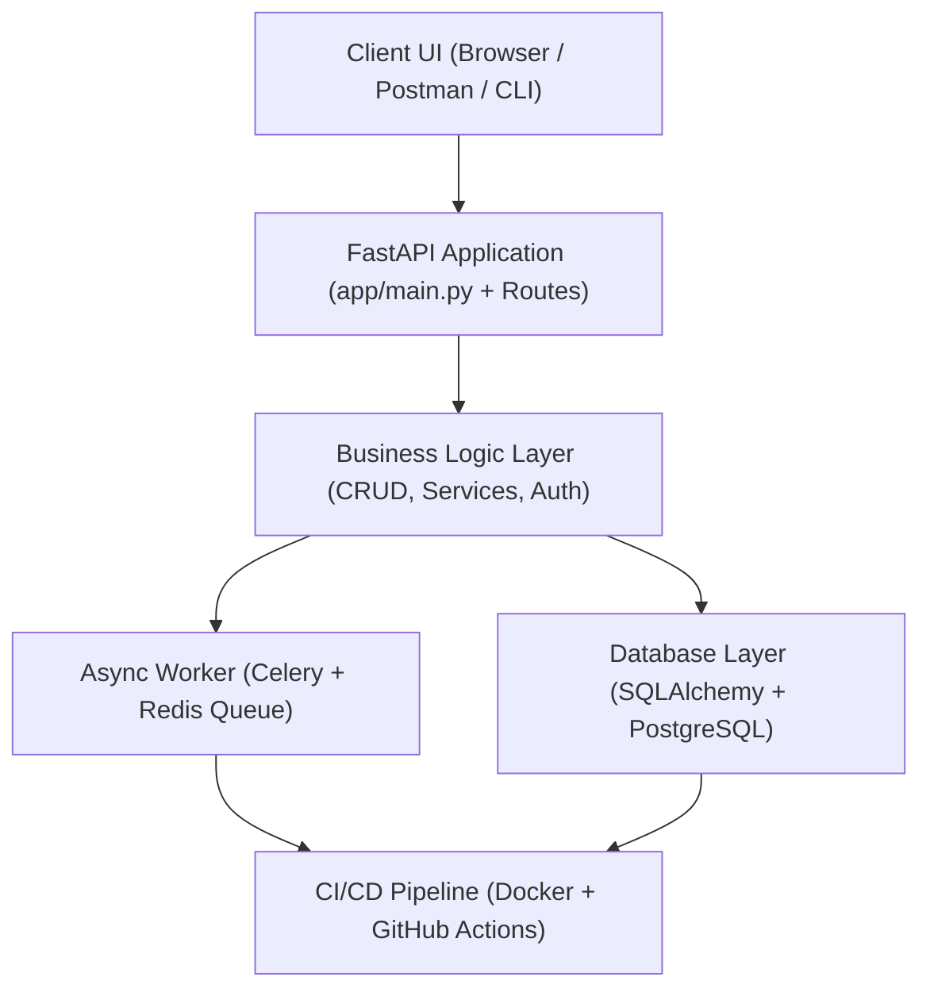
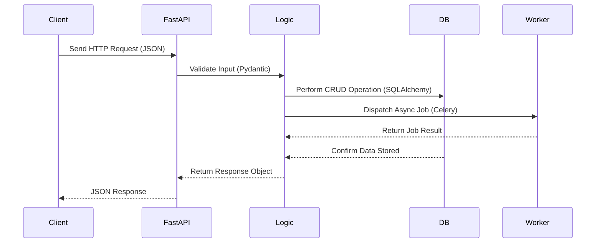

# FastAPI Task Automation
A production-grade FastAPI microservice designed for backend task automation with JWT authentication, PostgreSQL database, Celery + Redis background jobs, Docker and CI/CD integration, and automated testing.

---
## 🧠 Tech Stack
- FastAPI + SQLAlchemy + Alembic
- PostgreSQL + pgAdmin
- JWT Authentication (python-jose)
- Password Hashing (passlib[bcrypt])
- Environment Configuration (pydantic-settings)
- Docker Compose (multi-service with healthchecks)
---
## Day 1 — Project Initialization
Goal: create the base FastAPI project structure, set up a virtual environment, install dependencies, and verify that the API runs locally.

### Achievements
- Initialized Git repository and Python virtual environment  
- Installed FastAPI, Uvicorn, SQLAlchemy, Pydantic, Psycopg2-Binary, and Python-Dotenv  
- Added base route (`GET /`) returning a startup message  
- Verified server runs on http://127.0.0.1:8000  

---
## Day 2 — Database Integration (PostgreSQL + SQLAlchemy + Alembic)

### Goal
Integrate a production-ready relational database layer using Dockerized PostgreSQL, SQLAlchemy ORM, and Alembic migrations.

### Achievements
- 🐘 Deployed PostgreSQL 16 inside Docker (`pg-fastapi` container with volume `pgdata_fastapi`)
- 🔗 Configured `.env` with `DATABASE_URL` for dynamic connection management
- 🧩 Added `app/database.py` to handle SQLAlchemy engine, session factory, and Base class
- 📦 Implemented `app/models.py` with `Task` ORM model
- 🧠 Created Pydantic schemas in `app/schemas.py` for request/response validation
- 🛠️ Added CRUD logic (`app/crud.py`) and modular router (`app/routers/tasks.py`)
- 🚀 Updated `app/main.py` to register routers and initialize the FastAPI app
- ⚙️ Initialized **Alembic** for schema versioning  
  - Configured `alembic.ini` and dynamic `.env` loading in `alembic/env.py`
  - Generated first migration: `create tasks table`
  - Applied migration via `alembic upgrade head`  
- ✅ Verified connectivity with Dockerized PostgreSQL container on port 5433

## Day 3 — Docker Compose Enhancements & Production Readiness

### Goal
Containerize the full application stack and make it production-grade with automatic migrations, persistent volumes, healthchecks, and a visual database interface.

### Achievements
- 🐳 **Docker Compose setup:** runs FastAPI, PostgreSQL v16, and pgAdmin in a single command  
- 🧩 **Persistent volume:** database data stored safely in `fastapi-task-automation_pg_data` (survives restarts)  
- ⚙️ **Automated Alembic migrations:** via `start.sh` script executed on container startup  
- 💚 **Healthchecks:** PostgreSQL service validated with `pg_isready` before FastAPI starts  
- 🔒 **Secure `.env` loading:** all secrets (DB URL, pgAdmin login) moved to `.env`, excluded from Git  
- 🪵 **Logging & restart policy:** prevents log overflow and auto-restores crashed containers  
- 🧠 **pgAdmin UI:** visual PostgreSQL management on [http://127.0.0.1:5050](http://127.0.0.1:5050)  
  - Email → `${PGADMIN_DEFAULT_EMAIL}`  
  - Password → `${PGADMIN_DEFAULT_PASSWORD}`  
  - Connect host → `pg-fastapi`, port `5432`
  
---
## Day 4 — User Authentication & Security Layer

### Goal
Implement secure user authentication using JWT tokens, password hashing, and environment-based configuration.

### Achievements
- 👤 **User model:** Added `User` ORM table with unique `username`, `email`, and hashed passwords.
- 🔐 **Password hashing:** Integrated `passlib[bcrypt]` for secure password storage.
- 🧾 **JWT authentication:** Added `python-jose`-based token creation/verification.
- ⚙️ **Environment configuration:** Introduced `app/config.py` using `pydantic-settings` to load secrets from `.env`.
- 🔑 **Routers:**  
  - `/auth/signup` → user registration  
  - `/auth/login` → obtain JWT token  
  - `/users/me` → protected route (requires valid JWT)
- 🧩 **CORS middleware:** dynamically loaded from `.env` (`CORS_ORIGINS`)
- 🐳 **Docker Compose:** now loads `.env`, includes health-checks, and persistent volumes.
- ✅ **Verified Flow:** user can register → login → access `/users/me` with valid Bearer token.
### Example Authentication Flow
1. **Register a new user**
   ```bash
   curl -X POST http://localhost:8000/auth/signup \
     -H "Content-Type: application/json" \
     -d '{"username":"sami","email":"sami@example.com","password":"StrongPass123"}'
2. Login and get JWT token
curl -X POST http://localhost:8000/auth/login \
  -H "Content-Type: application/x-www-form-urlencoded" \
  -d "username=sami@example.com&password=StrongPass123" 
3. Access protected route
curl -H "Authorization: Bearer <YOUR_JWT_TOKEN>" \
  http://localhost:8000/users/me

graph TD
  A[app/] --> B[routers/auth.py]
  A --> C[models.py<br><sub>add User model</sub>]
  A --> D[schemas.py<br><sub>add UserCreate, UserLogin, UserOut</sub>]
  A --> E[security.py<br><sub>handle hashing & JWT utils</sub>]
  A --> F[crud.py<br><sub>add user CRUD</sub>]


---

## ⚙ Environment Variables (.env)
# Security
SECRET_KEY=change_me_to_a_long_random_secure_string
ALGORITHM=HS256
ACCESS_TOKEN_EXPIRE_MINUTES=30

# Database
DATABASE_URL=postgresql+psycopg2://task_user:task_password@db:5432/task_db

# Application
APP_NAME=FastAPI Task Automation
ENV=development
DEBUG=true
CORS_ORIGINS=http://localhost:3000,http://127.0.0.1:3000
### 🗂️ pgAdmin Access
After running `docker compose up -d --build`, visit:

- **pgAdmin:** http://localhost:${PGADMIN_LISTEN_PORT}  
- **Email:** `${PGADMIN_DEFAULT_EMAIL}`  
- **Password:** `${PGADMIN_DEFAULT_PASSWORD}`

Inside pgAdmin → Add a new server:  
- Name: `FastAPI DB`  
- Host: `db`  
- Port: `5432`  
- Username: `task_user`  
- Password: `task_password`


### Quick Reference Commands
```bash
# Run PostgreSQL in Docker (persistent volume)
docker run --name pg-fastapi \
  -e POSTGRES_USER=task_user \
  -e POSTGRES_PASSWORD=task_pass \
  -e POSTGRES_DB=task_db \
  -p 5433:5432 \
  -v pgdata_fastapi:/var/lib/postgresql/data \
  -d postgres:16

# Apply database migrations
alembic revision --autogenerate -m "create tasks table"
alembic upgrade head

# Start the FastAPI server
uvicorn app.main:app --reload
---
## Quick Start

```bash
# 1. Clone repository
git clone git@github.com:SulimanKh87/fastapi-task-automation.git
cd fastapi-task-automation

# 2. Create and activate virtual environment
python -m venv venv
source venv/Scripts/activate      # or venv\Scripts\activate on Windows

# 3. Install dependencies
pip install -r requirements.txt

# 4. Run FastAPI server
uvicorn app.main:app --reload

Then open http://127.0.0.1:8000
```
Visit:
http://127.0.0.1:8000
 → root message
http://127.0.0.1:8000/docs
 → Swagger UI (auto docs)

## System Architecture



**Key Components**
- **FastAPI** — REST API framework (main entry point)
- **SQLAlchemy / PostgreSQL** — relational data storage
- **Celery + Redis** — asynchronous background task queue
- **Docker + GitHub Actions** — containerization & CI/CD automation
- **Pytest** — testing & coverage for backend logic

```markdown
## API Workflow Overview

🧠 Workflow Summary
Client sends an HTTP request (e.g., POST /tasks)
FastAPI receives → validates via Pydantic Schemas
Business Logic executes CRUD via SQLAlchemy models
Celery Worker performs async jobs if needed
Database stores data (PostgreSQL engine)
FastAPI returns a JSON response to the client


## 📁 Project Structure
📦 **fastapi-task-automation/**
├── 🧠 **app/** — main FastAPI backend  
│   ├── ⚙️ `main.py` — app entrypoint  
│   ├── 🔐 `security.py` — JWT & password hashing  
│   ├── 🧱 `models.py` — SQLAlchemy models  
│   ├── 🧩 `schemas.py` — Pydantic data models  
│   ├── ⚡ `deps.py` — shared dependencies  
│   ├── 🧰 `config.py` — environment configuration  
│   └── 🛣️ **routers/** — route modules  
│       ├── `auth.py` — login/signup  
│       └── `users.py` — authenticated routes  
│
├── 🗄️ **alembic/** — migrations  
│   └── `versions/` — revision history  
│
├── 🐳 `docker-compose.yml` — services orchestration  
├── 🐍 `requirements.txt` — dependencies  
├── 🧾 `.env` — environment secrets (excluded from git)  
└── 📘 `README.md` — project documentation


## Dependencies
fastapi==0.120.0
uvicorn==0.38.0
sqlalchemy==2.0.44
psycopg2-binary==2.9.11
alembic==1.17.0
python-jose[cryptography]==3.5.0
passlib[bcrypt]==1.7.4
pydantic==2.12.3
pydantic-settings==2.11.0
email-validator==2.3.0
python-dotenv==1.1.1


## License
MIT License
## Author
Suleiman Khasheboun
Email: suli.tempmail2022@gmail.com
GitHub: https://github.com/SulimanKh87